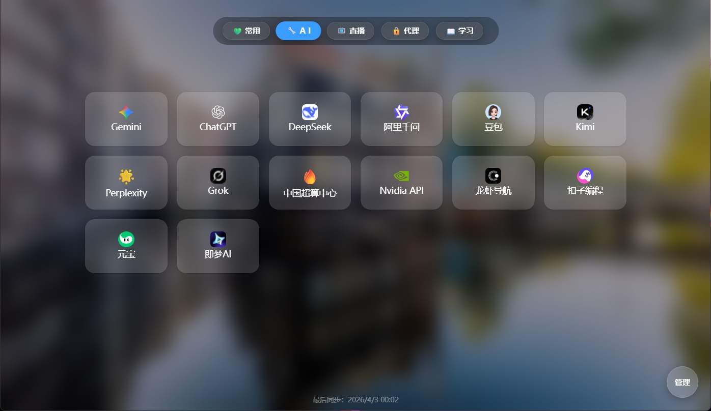
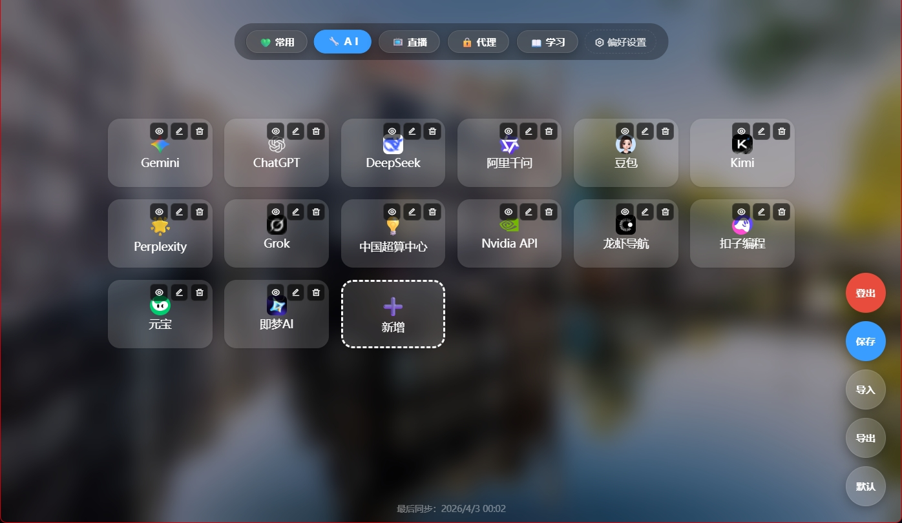
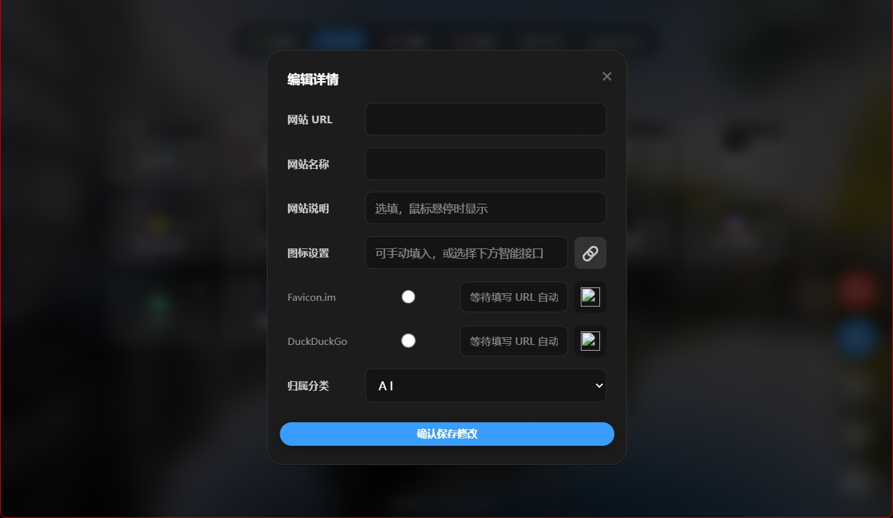
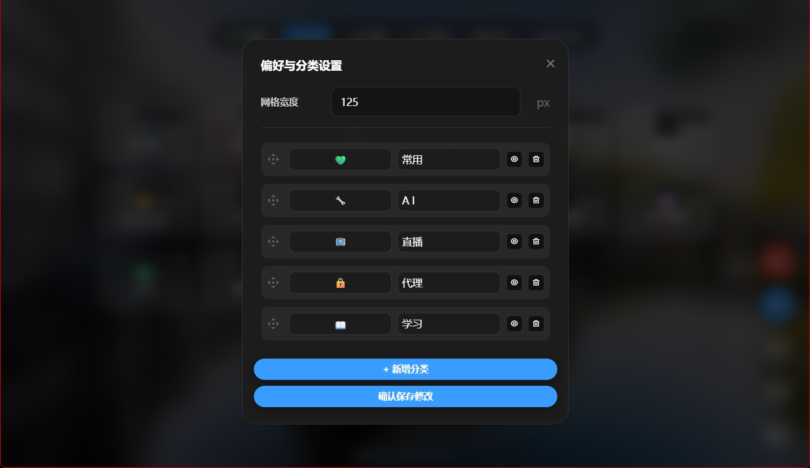

# 🧭 CloudNav - 极简高效的个人网站导航

<div align="center">


**基于 Cloudflare Pages 和 Workers KV 构建的纯云端、无服务器个人导航页。**<br>
零代码基础，全程使用 Google Gemini 问答和生成代码，采用响应式毛玻璃（Glassmorphism）卡片设计，原生 JavaScript 开发，0 成本 5 分钟极速部署。

[👉 在线预览 Demo 👈](https://111.222)

</div>

## 📸 界面预览

<table style="width: 100%; border-collapse: collapse; border: none;">
  <tr style="border: none;">
    <td align="center" style="border: none; width: 50%;">
      
      <br>
      <sub><b>✨ 首页页面预览</b></sub>
    </td>
    <td align="center" style="border: none; width: 50%;">
      
      <br>
      <sub><b>⚙️ 后台管理页面预览</b></sub>
    </td>
  </tr>
  <tr style="border: none;">
    <td align="center" style="border: none; width: 50%;">
      
      <br>
      <sub><b>➕ 网址条目新增页面预览</b></sub>
    </td>
    <td align="center" style="border: none; width: 50%;">
      
      <br>
      <sub><b>📁 分类管理页面预览</b></sub>
    </td>
  </tr>
</table>

---

## ✨ 核心特性

- 🚀 **极速轻量**：纯原生 HTML/CSS/JS 开发，无冗余前端框架，丝滑流畅的交互体验。
- 🎨 **现代 UI 设计**：采用高级毛玻璃（Glassmorphism）视觉效果，自适应 6 列网格布局，悬停上浮动画。
- 🛠️ **纯云端无服务器**：完美接入 Cloudflare Pages + KV 数据库，**零服务器成本**，免去繁琐运维。
- 🖼️ **动态每日壁纸**：自动拉取 Bing 每日高清壁纸，搭配半透明暗色遮罩，每日都有新鲜感。
- 📱 **完美响应式与 PWA**：自动适配 PC 端与移动端屏幕，支持 PWA 离线缓存，可像原生 App 一样添加到桌面。
- 🔒 **内置可视化后台**：安全 Token 鉴权，支持在线可视化增删改查分类与书签，支持鼠标/手指**拖拽排序**。
- 🤖 **智能图标获取**：内置 Favicon.im 和 DuckDuckGo 接口，填入网址自动智能抓取网站图标。

---

## 💻 技术栈

* **前端视图**：HTML5, CSS3, ES6 Vanilla JavaScript
* **后端 API**：Cloudflare Pages Functions (`functions/api/config.js`)
* **数据存储**：Cloudflare Workers KV
* **第三方库**：
  * [SortableJS](https://github.com/SortableJS/Sortable) - 实现丝滑的拖拽排序
  * [RemixIcon](https://remixicon.com/) - 开源精美字体图标库

---

## 📂 目录结构

```text
├── public/                      # 静态前端资源 (Pages 部署的根目录)
│   ├── assets/                  # 辅助资源
│   │   ├── css/
│   │   │   └── style.css        # 抽离出的 CSS 样式
│   │   ├── js/
│   │   │   ├── app.js           # 核心前端逻辑
│   │   │   └── utils.js         # 通用工具函数 (如 escapeHTML, debounce)
│   │   └── img/                 # 项目预览图或 UI 图片
│   │       └── preview/         # 项目预览截图
│   ├── index.html               # 纯净的 HTML 入口
│   ├── manifest.json            # PWA 配置
│   └── ServiceWorker.js         # PWA 核心脚本
├── functions/                   # 后端 Serverless API
│   └── api/
│       ├── config.js            # API 处理逻辑
│       └── defaultData.js       # 默认初始化数据
├── .gitignore                   # 忽略本地配置文件
└── README.md                    # 项目文档
```

---

## 🚀 部署指南 (Cloudflare Pages)

完全免费，整个部署过程不超过 5 分钟！

### 第一步：上传到 GitHub
1. 将此文件夹上传到你的 GitHub 仓库

### 第二步：创建 Cloudflare 项目
1. 登录 [Cloudflare 控制台](https://dash.cloudflare.com/)
2. 在左侧菜单找到 **Workers & Pages** -> 点击 **创建应用程序 (Create application)**
3. 切换到 **Pages** 标签页，点击 **连接到 Git (Connect to Git)**
4. 授权 GitHub 并选择你刚刚准备好的仓库
5. **构建设置 (Build Settings)**：
   * 框架预设 (Framework preset): `None`
   * 构建命令 (Build command): *(留空)*
   * 构建输出目录 (Build output directory): `public`
6. 点击 **保存并部署 (Save and Deploy)**

### 第三步：配置 KV 数据库与密码
1. 回到 Cloudflare 控制台，进入左侧 **Workers & Pages** -> **KV**，点击 **创建命名空间 (Create a namespace)**，名字随便起（例如 `my_nav_db`）
2. 进入你刚才部署好的 Pages 项目详情页，点击 **设置 (Settings)** 选项卡
3. **绑定 KV 数据库**：
   * 找到 **Functions** -> **KV 命名空间绑定 (KV namespace bindings)**
   * 变量名称 (Variable name) **必须严格填入**: `nav`
   * KV 命名空间 (KV namespace) 选择你刚才创建的数据库
4. **设置管理员密码**：
   * 在左侧找到 **环境变量 (Environment variables)**
   * 添加变量，名称 **必须严格填入**: `TOKEN`
   * 值 (Value) 填入你想要的后台登录密码（建议点击右侧的 `加密` 按钮保护密码）

### 第四步：重新部署生效
1. 返回到项目的 **部署 (Deployments)** 页面
2. 找到最新的一次部署记录，点击最右侧的三个点 `...` -> **重试部署 (Retry deployment)**
3. 部署完成后，点击系统分配的域名，即可访问！

---

## 🎮 使用说明

1. **进入后台**：点击页面右下角的浮动按钮 **"管理"**，输入你在环境变量中设置的 `TOKEN`
2. **新增分类**：进入管理模式后，点击 **"偏好设置"** 按钮
3. **添加书签**：在对应分类下点击虚线框的 **"新增"** 卡片
4. **隐藏书签**：点击书签右上角的 👁️ 眼睛图标
5. **保存修改**：请务必点击右下角的 **"保存"** 按钮

---

## 📄 开源协议

本项目采用 [MIT License](LICENSE) 开源协议。
